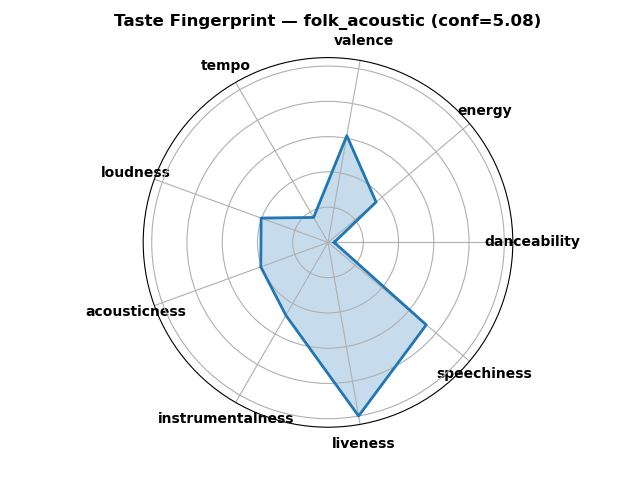
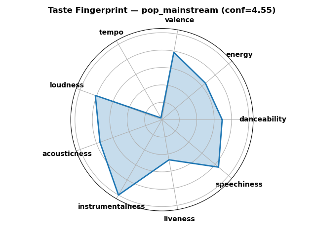
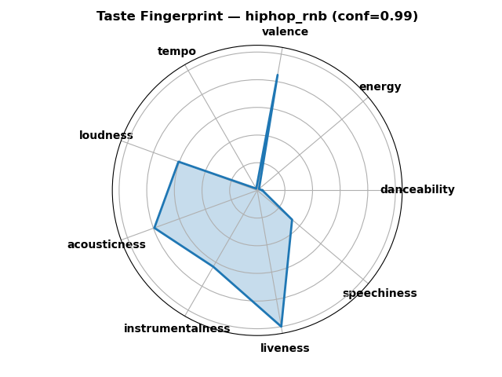
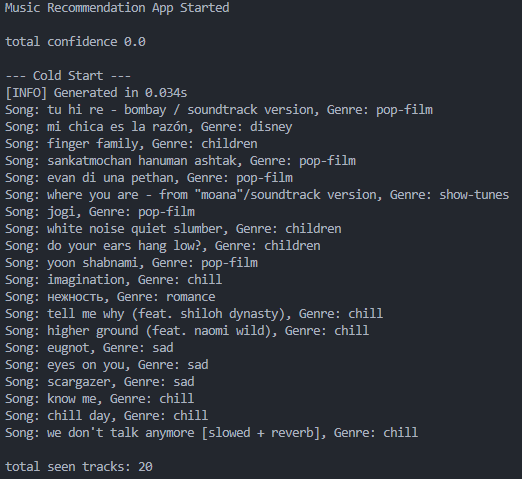
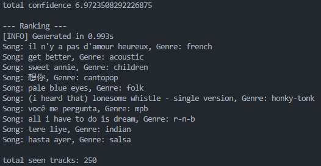
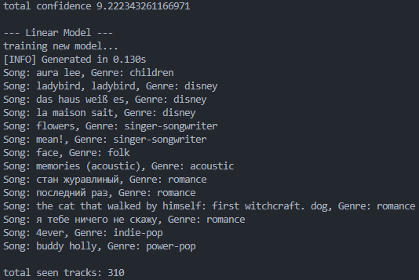
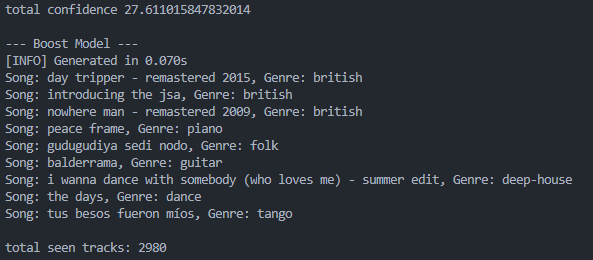
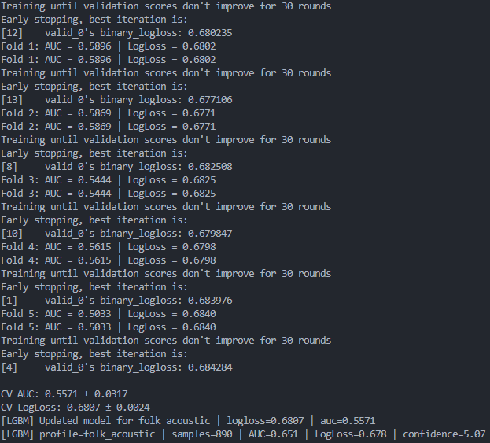

# Multi-Modal Music Recommendation System

This project is a content-based music recommendation system inspired by Spotify-style behavior.
It models multiple independent musical tastes per user and progressively upgrades its recommendation strategy as more feedback is collected.

The system is designed to handle users with diverse, even contradictory tastes (for example metal, J-pop, and Latin music) without collapsing them into a single preference vector.

  

---

## Overview

The recommender evolves through multiple stages:

1. Cold start recommendations
2. Exploration-oriented fallback recommendations
3. Similarity-based ranking
4. Supervised machine learning models
5. Gradient-boosted models for advanced users
6. TODO: Neural-Network suggester

Each stage is selected dynamically based on user confidence and interaction count.

---

## Core Concepts

### Multi-Taste User Profile

A user is represented by multiple independent taste profiles.
Each taste profile corresponds to a coherent musical cluster and contains:

* A centroid vector of liked and weighted disliked songs
* A confidence score derived from feedback
* A liked songs counter
* A disliked songs counter
* A genre distribution

Taste profiles are never merged together.

<h3 align='center'> Profile plotting:</h3>

  
  
  
  
  
  

---

## Genre Clustering

Genres are grouped into semantic clusters to improve stability, interpretability, and exploration.

Clusters are used to:

* Initialize taste profiles
* Control exploration
* Split recommendations across tastes
* Train per-taste models

Ambient, white-noise, background, and sleep-related genres are explicitly excluded.

---

## Recommendation Pipeline

### Cold Start

Used when the user has little or no confidence.

Characteristics:

* Popularity-aware filtering
* Artist diversity
* Cluster diversity
* No personalization assumptions

<h3 align='center'> Cold start recommendations:</h3>

---

### Fallback Recommender

Used when confidence is low to medium-low.

Characteristics:

* Less popular songs to explore
* Majority of recommendations from strong taste profiles
* Small fraction (about 20 percent) from weak or inactive profiles
* Songs scoring
* Encourages controlled exploration

<h3 align='center'> Fallback recommendations:</h3>

---

### Ranking Recommender

Used when a stable profile exists (medium confidence).

Characteristics:

* Cosine similarity against taste profile vectors
* Weighted audio features
* Dislike-aware penalties
* Stable and exploitative behavior

<h3 align='center'> Ranking algorithm:</h3>

---

### Model-Based Recommender

Activated once sufficient feedback has been collected.

Characteristics:

* One model per taste profile
* Even split of recommendations across active tastes
* Small exploration from weakest profiles
* Models trained only when enough samples are available

---

## Machine Learning Models

### Features

All models operate on Spotify-style audio features:

* Danceability
* Energy
* Valence
* Tempo
* Loudness
* Acousticness
* Instrumentalness
* Liveness
* Speechiness

### Models Used

* Logistic Regression for early supervised learning
* LightGBM for advanced users with large interaction histories

Each taste profile has its own model, trained only if it has enough positive and negative samples.

---

## Model Training Strategy

* Models are retrained every N interactions
* Profiles with insufficient samples are locked out from training
* Early stopping is used for LightGBM
* Performance metrics (AUC, LogLoss) are logged per profile

  <h3 align='center'> LinearRegressor Prediction </h3>
  

    
  

  <h3 align='center'> LGBM Prediction phase</h3>
  

    
  

  <h3 align='center'> LGBM Training phase</h3>
  

    
  

---

## User Feedback

The system uses explicit feedback:

* Like
* Dislike

Feedback updates:

* Taste profile vectors
* Confidence scores
* Genre distributions
* Training datasets

---

## Simulated Users

A deterministic simulated user system is included.

Characteristics:

* Seed-based reproducibility
* Stable internal preferences
* Useful for testing exploration and convergence behavior
* Allows benchmarking different algorithms

---

## License

MIT License
